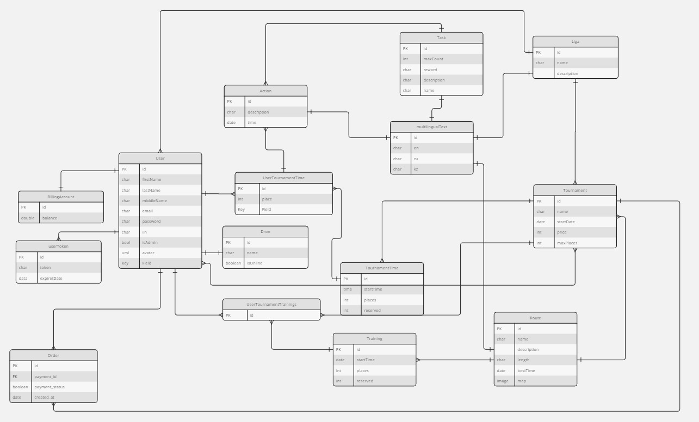

# Database Schema Documentation

The Game of Drones Platform relies on a structured database schema to manage and store data efficiently. Below is a detailed overview of the database schema based on the UML diagram provided.

## Tables Overview

### User

Stores information about users.

-   **id**: Primary key, unique identifier for each user.
-   **firstName**, **lastName**, **middleName**: User's name.
-   **email**: User's email address, used for login.
-   **password**: Hashed password for user authentication.
-   **isAdmin**: Boolean flag indicating if the user has administrative privileges.
-   **avatar**: URL to the user's avatar image.

### BillingAccount

Linked to `User`, holds billing information.

-   **id**: Primary key, linked to the User's ID.
-   **balance**: Current balance of the user's billing account.

### UserToken

Manages user session tokens.

-   **id**: Primary key.
-   **token**: The actual token string.
-   **expireDate**: Expiration date of the token.

### Order

Tracks orders placed by users.

-   **id**: Primary key.
-   **payment_id**: Foreign key to the payment system.
-   **payment_status**: Status of the payment.
-   **created_at**: Timestamp of when the order was placed.

### Liga, Tournament, TournamentTime

These tables handle the organization and scheduling of tournaments.

-   **Liga**: Contains different leagues.
-   **Tournament**: Individual tournaments within leagues.
-   **TournamentTime**: Specific times for tournaments.

### Drone

Stores details about drones.

-   **id**: Primary key.
-   **name**: Name of the drone.
-   **isOnline**: Boolean flag indicating if the drone is online.

### Action, Task, Route

These tables are related to activities and challenges within the platform.

-   **Action**: Individual actions that can be taken.
-   **Task**: Collections of actions forming tasks.
-   **Route**: Paths that drones can take, with associated data.
